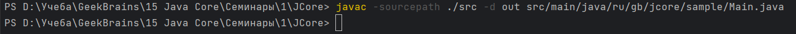
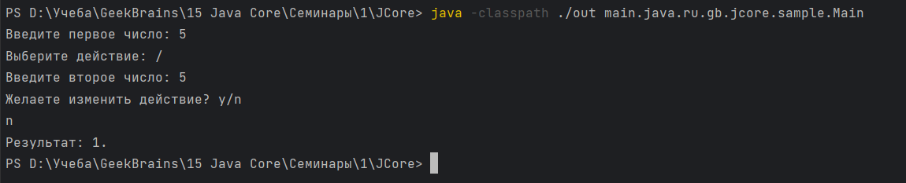
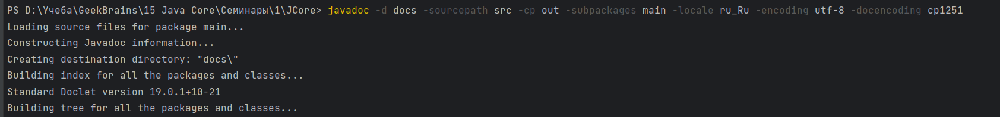
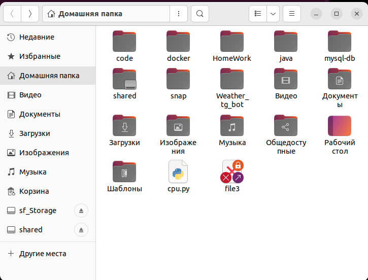
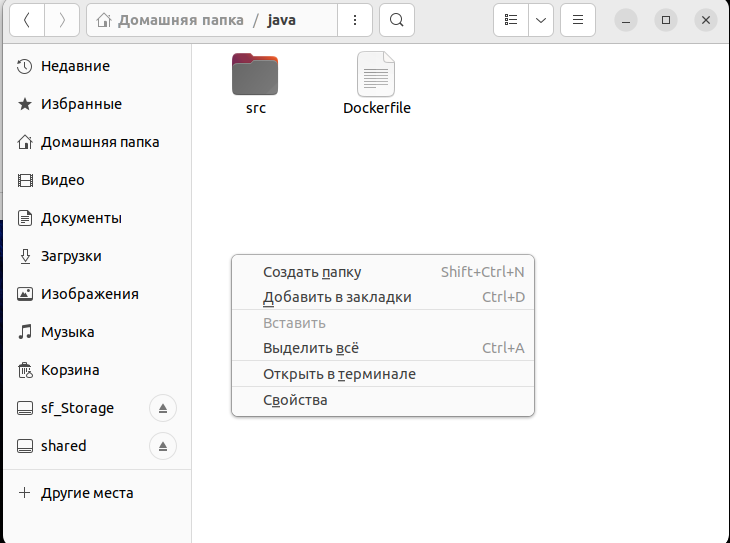
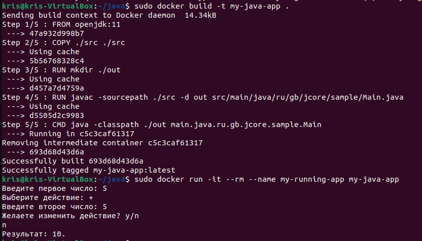

# Java Core 

## Домашняя работа №1

### Задание
Создать проект из трёх+ классов (основной с точкой входа и два класса в другом пакете),
которые вместе должны составлять одну программу (простое приложение на Ваш выбор), которое просто демонстрирует работу некоторого механизма).
Пример моего приложения - в материалах урока.

Необходимо установить Docker Desktop.

(*) Создать Dockerfile, позволяющий откопировать исходный код вашего приложения в образ для демонстрации работы вашего приложения при создании соответствующего контейнера.


## Выполнение

Был реализован простой калькулятор с возможностью изменить действие.

Была произведена сборка, запуск и создание документации. Для этого были применены следующие команды:
```powershell
javac -sourcepath ./src -d out src/main/java/ru/gb/jcore/sample/Main.java

java -classpath ./out main.java.ru.gb.jcore.sample.Main

javadoc -d docs -sourcepath src -cp out -subpackages main -locale ru_Ru -encoding utf-8 -docencoding cp1251

```







## Dockerfile и запуск в контейнере

Создаем Dockerfile без расширения в корне проекта.

Содержимое файла:
```Dockerfile

FROM openjdk:11

COPY ./src ./src

RUN mkdir ./out

RUN javac -sourcepath ./src -d out src/main/java/ru/gb/jcore/sample/Main.java

CMD java -classpath ./out main.java.ru.gb.jcore.sample.Main
```

Папку с проектом (src и Dockerfile) копируем в общую папку виртуальной машины (sf_Storage). Внутри виртуальной машины переносим папку с проектом в Домашнюю папку пользователя. 



Открываем терминал в папке проекта. 



Собираем образ и запускаем контейнер:

```bash
# команда сборки образа
sudo docker build -t my-java-app . 

# команда запуска контейнера
sudo docker run -it --rm --name my-running-app my-java-app
```




